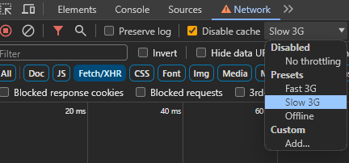

# Video Recorder Uploader

This simple app is meant to let users record a selfie, up to 20 seconds, and then let users upload that video on a server after reviewing it.

## Installation and Running the app

- Make sure to have Nodejs +16 installed
- Clone the app
- Run `npm install`
- Start `npm start`
- App is accessible from [http://locahost:3000](http://locahost:3000)

## Testing upload progress

If running the app locally, most probably won't be able to see the progress bar is working.

To test that you can use the throttling from browsers developer tools

